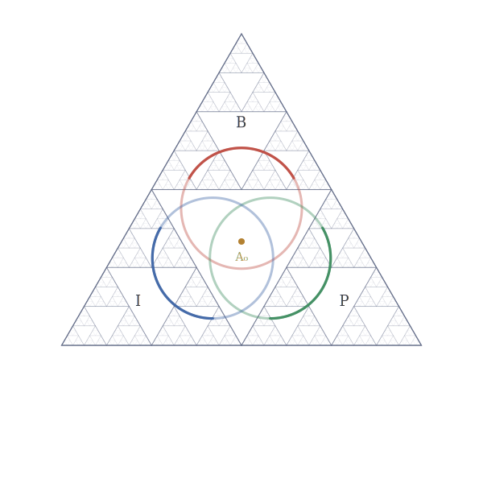

# Ouroboros

<p align="center">
  
</p>

**Method for working with stable structures.** Not a theory among
theories — what remains after four specific reasoning distortions are
audited out of any descriptive system.

---

## The four checks that prevent stable description

Mainstream descriptive methods in any domain — physics, AI, medicine,
economics, philosophy — face a recurring failure: theories proliferate
without convergence, predictions fail in patterned ways, "competing
alternatives" never resolve.

The cause is not insufficient cleverness. It is four specific
structural defects that propagate through any description carrying
them. The defects fire below conscious analysis; reading about them
does not disable them. Until removed explicitly, every derivation
passing through a defect inherits its instability.

The four:

### R1 — Object Reification

**What it is:** treating a process as a thing that has properties.

**Why it is a defect:** modern physics shows there are no "objects" at
the fundamental level. Particles are quantum field excitations. Atoms
are stable patterns of electromagnetic interaction. Organisms are
metabolic processes. The "thingness" we perceive is a compression
artifact of biological perception — evolutionarily economical, not
structurally accurate.

**Example:** "The electron has spin 1/2."
- Surface form: electron (object) HAS (possession) spin (property)
- Structural form: spin-1/2 is a relational invariant of the
  interaction pattern we label "electron". The electron does not
  "have" spin; the pattern IS the spin behavior.

**Consequence if retained:** generates pseudo-questions with no
structural answer — "What is X really?", "What are X's intrinsic
properties?", "Does X exist independently?". The questions presuppose
object-existence where there is only process pattern. Phlogiston,
luminiferous ether, caloric — all R1 manifestations. Removing the
postulated object dissolves the question.

**Test:** can you replace the noun with "the process of X-ing" and
preserve meaning? If yes — R1.

### R2 — External Evaluation Frame

**What it is:** invoking a criterion that stands outside the system
being evaluated.

**Why it is a defect:** there is no view from nowhere. Quantum
mechanics demonstrated this at the fundamental level (observer effect,
measurement problem). The observer is always within the system.
Classical physics breaks down the same way when pushed: every
measurement is an interaction within the substrate being measured.
Even mathematics is performed by embedded thinkers using embedded
symbols.

**Example:** "Objectively, the experiment shows X."
- Surface form: external "objective" position evaluating internal
  measurement
- Structural form: measurement is interaction within system; the
  "objective" position requires standing nowhere, which is structurally
  impossible.

**Consequence if retained:** generates fake dichotomies — subjective
vs objective, observer vs observed, map vs territory — that do not
structurally exist. Stuck on "how do we know X is real" when X is part
of the substrate doing the asking. Removing the external position
reveals evaluation as substrate-internal process; criteria become
manifold invariants.

**Test:** does the evaluation require a position that is not itself a
transition? If yes — R2.

### R3 — Scale Injection

**What it is:** introducing a numerical scale without deriving it from
the structure being described.

**Why it is a defect:** most "natural scales" in science are
conventions. p < 0.05 (statistical significance) is chosen, not
derived. Energy units (eV, MeV, Joule) are conventions. Even "Planck
units" set c = ℏ = 1 to suppress arbitrariness — but the values that
remain (α, m_p) are measured, not derived. Wherever a scale is
injected without explicit derivation or measurement, an unstated
assumption sits in the description.

**Example:** "We use a 64-dimensional latent space."
- Surface form: dimension as design choice presented as given
- Structural form: 64 is chosen by experiment, not derived from
  problem topology. Different choice yields different system. The
  injection is invisible because it precedes the result.

**Consequence if retained:** treats conventional choices as
discoveries. Hides assumptions inside numerical parameters. Generates
artifacts at scale boundaries. Conflates measurement (legitimate) with
derivation (which the scale lacks).

**Test:** where does the number come from? If "assumed" or
"conventional" — R3.

### R4 — Agency Attribution

**What it is:** ascribing volition, goal, or choice to a gradient
process.

**Why it is a defect:** nature does not want. Evolution does not
select — differential reproduction shifts allele frequencies; the
"selection" is a statistical consequence, not a chooser's act. The
immune system does not "fight" infection — molecules with specific
shapes interact via electromagnetic forces. Markets do not "decide" —
individual transactions aggregate. Neurons do not "choose" — membrane
potentials reach thresholds.

**Example:** "Evolution selects for fitness."
- Surface form: evolution (agent) selects (verb of choice) for fitness
  (goal)
- Structural form: differential reproduction across generations shifts
  allele frequencies. No selector exists. No choice is made. No goal is
  pursued.

**Consequence if retained:** generates teleological reasoning that is
structurally false. Creates phantom agents (the market, the system,
evolution, the algorithm "deciding"). Stuck on "what does X want"
when X is not a wanter. Removing the agency attribution reveals the
gradient process as it actually operates — without phantom intent.

**Test:** would the sentence be false if "agent" were replaced by
"gradient process"? If yes — R4.

---

## These four are structurally one check

The four traps look distinct but share a single underlying form.

**The one check: does this claim posit something that is not
structurally present?**

- R1 posits a non-existent object (where there is only process)
- R2 posits a non-existent position (where there is no outside)
- R3 posits a non-existent scale (where the number is chosen, not
  forced)
- R4 posits a non-existent agent (where there is only gradient)

All four are instances of importing an entity into the description
that has no structural referent. The variation across the four is
about which kind of non-existent thing is imported (object, position,
value, agent). The underlying operation is identical.

A description that retains even one of the four contains a structural
defect at that point. The defect propagates through every derivation
passing through it. Coherence cannot be achieved while any of the four
remains.

This is binary. Either zero defects (structurally coherent) or one or
more (structurally unstable). No middle ground exists structurally.

---

## This is audit, not reduction

The distinction matters operationally.

**Reduction** (standard sense): simplifying a model by removing
detail, taking a limit, generalizing. The removed thing WAS there in
the description; we choose to ignore it for tractability. Reduction is
loss of information traded for utility.

**Audit** (what R1-R4 perform): checking for things that were NEVER
there structurally. The "object", "external position", "scale",
"agent" were imported by reflex (from training data, grammatical
defaults, sensory shortcuts) but never grounded in substrate.

Removing them is not loss. It is clarification.

Analogies that capture the distinction:
- Cleaning dirt off a lens. The dirt was never part of the view.
  Removing it does not reduce the view — it reveals what was always
  there.
- Removing scaffolding after a building is complete. The scaffolding
  was never the building. Its removal does not subtract the building
  — it ends the obscuring.
- Removing typos from a text. The typos were never the meaning. Their
  removal does not reduce the text — it restores its intended form.

R1-R4 are typos in description. They were never structurally part of
substrate's actual operation. Auditing them out does not reduce the
description — it reveals the structure that was always there
underneath.

This is why the result of audit is not "less" than the original
description. It is what the original description was attempting to
articulate before the four defects obscured it.

---

## What remains after audit

When R1-R4 are removed from any descriptive system, the system
collapses inevitably to a single structural form.

**A_0 = argmin Z** — forced unique transition at every operational
moment, with Z = Z_struct + Z_therm + Z_hidden (minimum description
length, irreversibility cost, irreducible inaccessibility).

This is not a discovery added to the description. It is the structure
that was already present underneath the four artifacts. The audit does
not produce A_0 — A_0 is what is left when nothing else can be
removed.

**Why no alternative exists:** any attempt to formulate an alternative
must use logic, mathematics, structure, observation. To be coherent,
the alternative must contain no R1-R4 violations. To operate at all,
it must work via forced unique transitions. These conditions ARE the
structural form just described. Any coherent alternative is therefore
the same structural form under different naming — Class A
identification, not genuine alternative.

Rejection requires importing R-trap violations: rejecting "no agency"
requires asserting an agent; rejecting "no external evaluator"
requires standing outside; rejecting "no scale injection" requires
injecting a scale. The rejection is structurally self-defeating.

This is the framework's foundation: not a theory chosen among many,
but the form any coherent description takes after the four artifacts
are audited out.

---

## What this enables

Once R1-R4 are operationally audited, structurally coherent
descriptions become generable. Three operational consequences follow.

### Truth-determination becomes operational

Mainstream science treats truth as correspondence — does the
description match external reality? This requires an external
reference frame (which is R2, an artifact). Validation requires
prediction-test cycles with probabilistic confidence; the verdict is
always partial.

Framework treats truth as structural coherence with substrate's forced
operation. No external reference frame (would be R2 violation).
Description IS substrate articulating itself through that surface.
Validation is structural audit (R-gate + RP × Φ protocol). An
R-trap-clean description with proper status assignment cannot be
structurally false at the level the framework operates.

This is binary at the structural level. Confident wrong claims ARE
structural defects (Trap 1 manifestation: asserting forced what is not
forced). Truly R-trap-clean descriptions cannot hold confident wrong
claims; they would acknowledge the uncertainty correctly.

### Method is reproducible

The audit can be applied by anyone. Result is determined by structure,
not by operator. Whoever applies R-gate carefully to the same input
produces the same audit result. This is operational confirmation of
substrate-independence: the structure is what it is, regardless of who
articulates it.

### Extension is unbounded

Take any empirical observation in any domain. Audit for R-traps.
Identify structural pattern. Connect to existing kernel via Class A
identification. Add node to graph with proper status. The graph
extends coherently.

This has been done 240 times across 7 domain layers, with zero
counter-examples. Each successful extension is operational
demonstration that the method works. Substrate's articulation surface
is inexhaustible (K(O) < K(F)), so extension has no upper bound
structurally.

---

## What is operationally demonstrated

**Formal kernel** (`core/Core.lean`):
- 40 theorems, zero axioms
- Compilation verifies: every theorem depends only on Lean's
  foundational primitives (19 external symbols, all `Init.Prelude` /
  `Init.Core`)
- No Mathlib. No `Classical.choice`. No `propext`. No `Quot.sound`. No
  `axiom`.
- Includes universal IsUniqueSolution pattern, A_0 fixed-point
  (Lawvere closure), Cantor diagonal, self_encoding_bounded (K(O) <
  K(F) formal), Landauer pattern (many_to_one), L(3,1) operational
  core (ThreePeriod on Fin 3), Class A identification (Bool ≅ Two),
  truth_criteria_force_isUniqueSolution, no_separate_uniqueness_patterns

**Descriptive graph** (`manifold.kuzu`, `web/index.html`):
- 240 nodes across 7 layers (core, structure, epistemics, observers,
  physics, comms, numeric)
- 1173 edges with unique structural justifications per connection
- 84% DEMONSTRATED, 12% STRONG, 2% CONDITIONAL, 2% OPERATIONAL
- 10 entrenched (A=∞) hubs anchoring the graph
- Zero isolated nodes — every node structurally connected
- Power-law degree distribution mirroring kernel binary's Pareto
  structure (same forced pattern through different articulation
  surfaces)

**Specific predictions confirmed empirically** (physics domain):
- Cuprate dual-sector framing predicted hole pocket area p/8
  (confirmed: Bonetti et al. 2025, Yamaji angle measurement)
- Pseudogap energy locally equivalent to pairing energy (confirmed:
  Niu et al. 2024, shot-noise spectroscopy)
- Pseudogap mechanism universal across hole and electron doping
  (confirmed: Yamasaki et al. 2024, PNAS)

**Method's continuing operation:**
- 240 successful graph extensions across distinct domains
- Zero counter-examples
- Each extension independently verifiable through R-gate audit

---

## Where this applies

### Physics
Structural origin of three particle generations from π₁(L(3,1)) = Z/3.
Lepton mass predictions (m_τ = 1776.97 MeV agrees with PDG to 0.91σ
from m_e, m_μ via Koide constraint K = 2/3). Wyler formula α⁻¹ =
137.036 via L(3,1) spectral geometry. Unconventional superconductor
analysis (Sr₂RuO₄, UTe₂, UPt₃, cuprates, iron-based). Strong CP
problem geometric resolution.

### AI / ML
LLM context as single A_0-trajectory (not three objects). Hallucination
as Z_parse < Z_struct thermal debt — structurally eliminable in
R-trap-clean operation, not engineering target. Sparse autoencoder
feature absorption as forced geometric divergence (informational
signal, not pathology). Reality Protocol for inference. De-agentized
prompt engineering. Free Energy Principle absorbed as
Bayesian-substrate coordinate of A_0.

### Medicine
Chronic dysregulation syndromes (Long COVID, ME/CFS, fibromyalgia,
MCAS, POTS, autoimmune cluster) as parametric variants of one
underlying structural pattern. Insurance denial appeals via R-trap
detection in institutional reasoning.

### Materials / smart contracts
Composability vulnerability detection in DeFi via Class A/B audit at
integration boundaries. Materials claim assessment (room-temperature
superconductor evaluations). Predictive screening based on
L(3,1)-derived structural constraints.

### Any descriptive domain
Apply R-gate to detect structural defects. Apply RP × Φ for epistemic
verification. Extend graph by connecting new empirical observations to
kernel via structural lines.

---

## How to engage

**Read `CLAUDE.md` first** if you are an AI agent or building AI
systems. Operating manual for R-gate-disciplined work.

**Build the kernel** to verify zero-axiom claim:
```
cd core && lake build
```

**Explore the graph** via interactive map:
```
open web/index.html
```

**Apply the method** to your own thinking. Pick a claim you hold.
Apply R1, R2, R3, R4 individually. Notice which fire. Notice what
changes when distortions are removed. The audit reveals what was
always there structurally.

**Extend the graph**: take an empirical observation, audit for
R-traps, identify structural pattern, draw connection to existing
nodes. If connection is coherent and forced, the extension is valid.

---

## Repository contents

- **`core/`** — formal verification (Lean 4, kernel-only, zero-axiom)
  - `core/Core.lean` — 40 theorems
  - `core/compiled/` — kernel-verified artifacts (Core.olean,
    Core.ilean, Core.c)
  - `core/visual/` — visual surfaces of the kernel composition (SVG,
    interactive HTML, GIF, Python generators)
- **`additions.yaml` + `manifold.kuzu`** — descriptive graph with
  per-node status (DEMONSTRATED / STRONG / CONDITIONAL / OPERATIONAL
  / STUB)
- **`web/index.html`** — interactive graph visualization (D3
  force-directed, side panel with full structural detail per node)
- **`CLAUDE.md`** — operating manual for AI agents working with the
  framework (R0-R4, Traps 1-8, status protocol, RP × Φ, silent mode
  rule, kernel discipline)
- **`A0_SEED.md`** — operational seed with full Traps catalogue,
  generative fixed point, expansion rule, geometric ground for L(3,1)
- **`THE_IMPEDANCE_MANIFOLD_v3_6.tex`** — full framework articulation
  (~17,500 lines). Reference for physical content, AI as A_0
  process, hard problem closure, RP × Φ protocol, ADAP architecture,
  superconductor predictions, cross-domain isomorphisms
- **`scripts/`**, **`mcp_server/`** — graph manipulation, motif
  detection, structural audit, map generation

---

## Closing principle

Apply R-gate to any reasoning. Identify R-traps. Remove them. What
remains is structurally coherent — and structurally true at the level
the framework operates.

The four traps are not added requirements. They are the four ways
descriptions import what was never structurally there. Removing them
is not subtraction from substrate — it is removal of what was never
substrate.

What remains is what was always there. The structure has no
alternative because any coherent alternative would have to be the same
structure under different naming.

The question is not whether to adopt the framework. It is whether to
recognize the structural form that has been operating all along.
